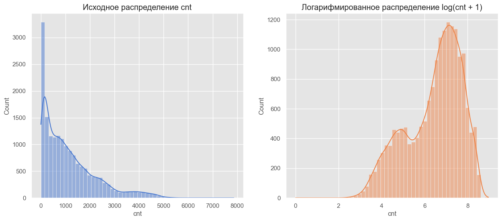
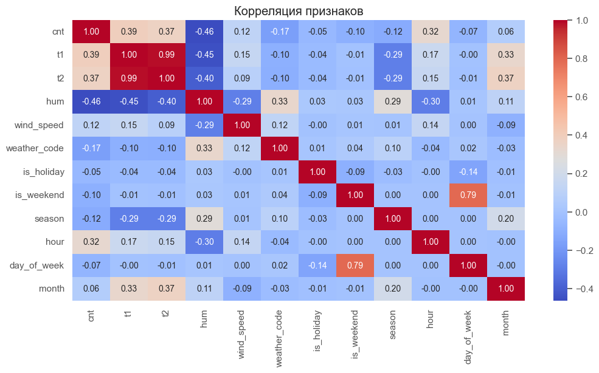
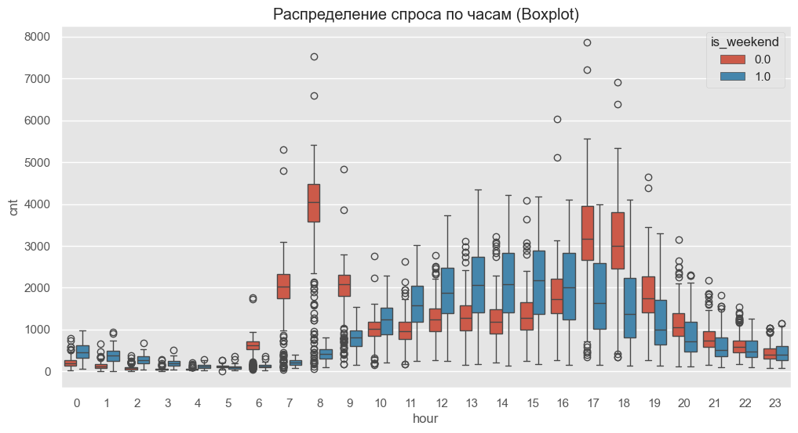
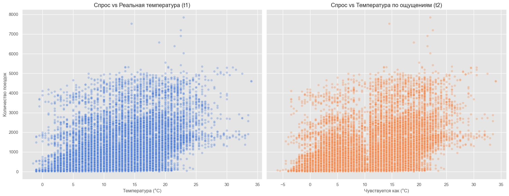
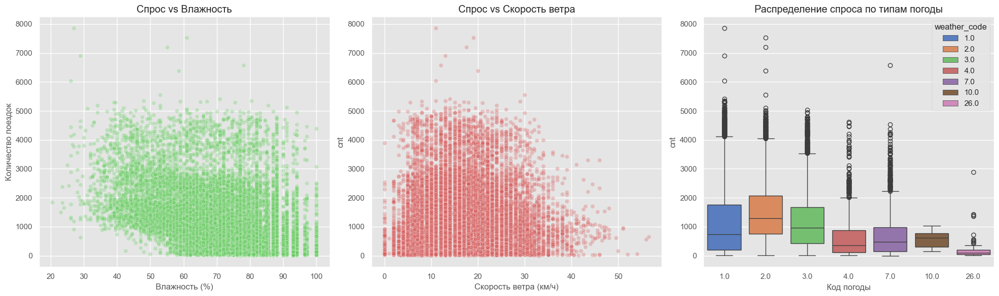
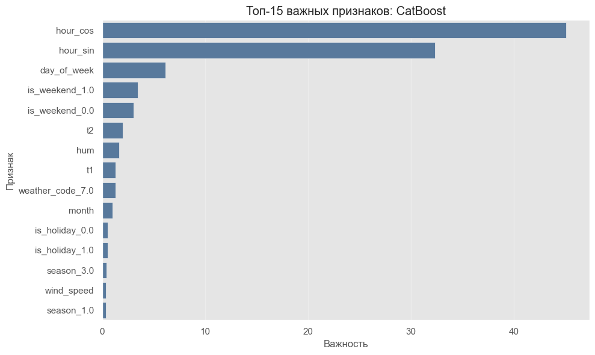
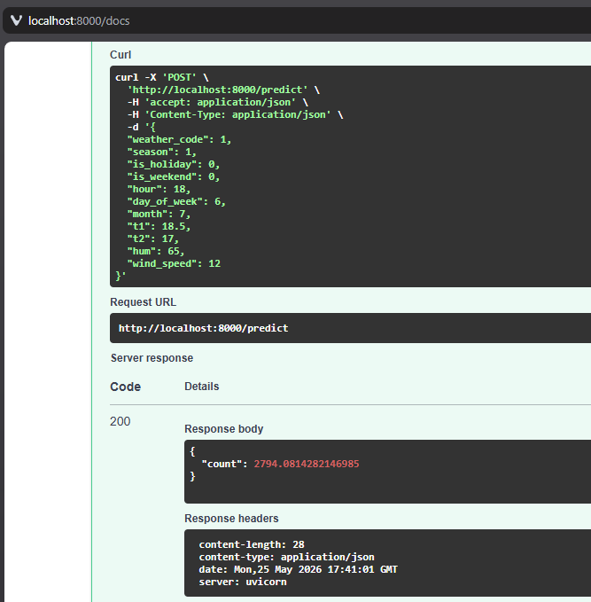

# Отчёт по проекту

**Студент:** Басов Андрей Игоревич
**Группа:** БИВ232

---

## 1. Введение и постановка задачи

- **Цель проекта:** составить модель, которая будет предсказывать спрос на прокат велосипедов в Лондоне на основе погодных условий и времени. Практическая ценность представляется в возможности оптимизации логистики (при ожидаемом скачке спроса можно распределить велосипеды на точках аренды заранее)
- **Формулировка задачи:** Регрессия - предсказать количество поездок на велосипедах на основе погодных условий и временных факторов
- **Обоснование метрики качества:** RMSE является основной метрикой, так как сильно штрафует модель за большие ошибки, что критично для предсказания спроса на велопрокат. Лучше ошибаться много, но чуть-чуть, чем ошибаться редко, но сильно. Вторичными метриками являются MAE и R2, выбранные за их простоту интерпретации.

---

## 2. Поиск и описание данных

- **Источник данных:** [London Bike Sharing Dataset](https://www.kaggle.com/datasets/hmavrodiev/london-bike-sharing-dataset). Выбран из-за соответствия требованиям для датасета, имеет высокое качество, отсутствия пропусков.
- **Описание датасета:**
  - Объём: 17414 строк, 10 столбцов

- **Описание столбцов:**
  - "timestamp" - Время наблюдения
  - "cnt" - количество арендованных велосипедов
  - "t1" - реальная температура в градусах Цельсия
  - "t2" - температура в градусах Цельсия "по ощущению"
  - "hum" - влажность в процентах
  - "wind_speed" - скорость ветра в км/ч
  - "weather_code" - категория погоды (категориальный признак)
  - "is_holiday" - булевое поле - 1 если праздник
  - "is_weekend" - булевое поле - 1 если выходной
  - "season" - категория сезонов: 0-весна; 1-лето; 2-осень; 3-зима

---

## 3. Обработка и подготовка данных

- **Полная очистка:**
  - Пропуски: отсутствуют
  - Дубликаты: полных дубликатов строк не обнаружено.
  - Выбросы: на целевой переменной `cnt` наблюдается длинный хвост и высокий пик около нуля. Выбросы сохранены для baseline модели, но в будущем планируется логарифмирование переменной.
  - Типы данных: поле `timestamp` приведено к `datetime64` для извлечения временных признаков.
- **Работа с фичами:**
  - Исходное количество признаков: 10
  - Новые фичи, feature engineering (какие созданы и зачем): на данный момент были извлечены временные признаки из `timestamp` - с ними легче работать моделям, чем с полной меткой `timestamp`.
    - `hour`: извлечён из `timestamp`
    - `day_of_week`: извлечён из `timestamp`
    - `month`: извлечён из `timestamp`
  - На baseline модели исключен признак `t2` из-за высокой корреляции с `t1`.
- **Визуализации:** в блокноте `01_eda.ipynb` построены графики обычного и логарифмического распределения `cnt`, построена heatmap корреляций между признаками, графики распределения спроса по часам в будние и выходные дни, и графики корреляции спроса и температуры.
  - **Распределение спроса:** Обычное распределение целевой переменной `cnt` имеет большой пик в районе 0 и длинный хвост справа. Логарифмирование делает распределение более симметричным, что может помочь более правильной работе моделей.
  
  - **Корреляция признаков:** Обнаружена практически линейная зависимость (0.98) между `t1` и `t2`. Целевая переменная `cnt` сильнее всего коррелирует с часом суток, температурой и влажностью (обратная связь).
  
  - **Распределение спроса по часам:** График показывает разницу аренды велосипедов в будние и выходные дни. В будние дни наблюдается два пика (час пик утром и вечером), а по выходным спрос распределен плавно по дневному времени. Это обосновывает использование признака `hour` как ключевого.
  
  - **Влияние температуры:** С ростом температуры количество поездок увеличивается. Однако при особенно высоких температурах (выше 30°C) намечается спад.
  
  - **Дополнительные погодные факторы:** Влажность свыше 85% и ветер более 30 км/ч заметно подавляют спрос. Анализ `weather_code` показал, что при кодах, соответствующих грозе или сильному снегопаду, количество поездок стремится к нулю, что подтверждает необходимость учета категорий погоды.
  

- **Сплит данных:**
  - Стратегия разбиения (train/val/test), соотношение: сделано разбитие train / val/ test. `train` — 11610 наблюдений (66.7%), `validation` — 2321 (13.3%), `test` — 3483 (20.0%).
  - Как избегали data leakage (если он мог возникнуть - временные ряды, утечка целевой и т.д.): последние 20% наблюдений полностью отложены в `test`, а на части `train_val` используется `TimeSeriesSplit(n_splits=5)`. Последний временной фолд выделяется как отдельный `validation`, поэтому модель и подбор гиперпараметров не используют будущие данные относительно валидации и теста.
  - Для воспроизводительности данных в блокноте `02_baseline.ipynb` установлен `SEED=42` для всех RNG.

---

## 4. Baseline-модель

- **Модель:** использовалась `LinearRegression` из `sklearn` без feature engineering
- **Результаты:**
  - **Train:** RMSE: 884.79, MAE: 650.55, R2: 0.26
  - **Test:** RMSE: 998.83, MAE: 705.86, R2: 0.22
- **Цель:** использовать эти значения как порог качества. Все остальные модели должны превышать эти метрики.

---

## 5. Эксперименты

**Гипотеза 1:** ансамбли будут давать лучший результат по сравнению с линейными моделями, ибо зависимость спроса от времени и погоды нелинейна.

**Как проверялось:** Было обучено 8 моделей, с дальнейшим подбором гиперпараметров для них в `GridSearchCV`.
- `Ridge`
- `KNN`
- `Decision Tree`
- `Random Forest`
- `XGBoost`
- `LightGBM`
- `CatBoost`
- `SVR`

После подбора была выбрана модель с минимальной ошибкой RMSE на `val` выборке.

**Результат:** лучшие результаты показали ансамбли на деревьях, особенно boosting-модели `CatBoost`, `LightGBM` и `XGBoost`. Простые модели (`Ridge`, `KNN`) значительно уступили по качеству.

---

**Гипотеза 2:** качество каждой модели будет зависеть от гиперпараметров, используемых для ее обучения.

**Как проверялось:** Было обучено 8 моделей, с дальнейшим подбором гиперпараметров для них в `GridSearchCV`.
После подбора была выбрана модель с минимальной ошибкой RMSE на `val` выборке.

**Результат:** подбор гиперпараметров позволил получить более хорошие результаты на всех моделях.


| Модель | Параметры | RMSE_val | R2_val | Комментарий |
|--------|-----------|----------|--------|-------------|
| CatBoost | `depth`, `iterations`, `learning_rate`, `l2_leaf_reg` | 266.4703 | 0.9529 | Лучшая модель на validation |
| LightGBM | `n_estimators`, `learning_rate`, `num_leaves`, `feature_fraction` | 281.9683 | 0.9473 | Один из лучших результатов |
| XGBoost | `n_estimators`, `learning_rate`, `max_depth`, `subsample`, `colsample_bytree` | 284.6780 | 0.9462 | Очень близок к LightGBM |
| Random Forest | `n_estimators`, `max_depth`, `min_samples_leaf` | 293.7703 | 0.9428 | Хороший результат, но слабее boosting |
| Decision Tree | `max_depth`, `min_samples_leaf` | 334.2247 | 0.9259 | Лучше baseline, но хуже ансамблей |
| SVR | `C`, `epsilon`, `kernel` | 971.5045 | 0.3739 | Существенно уступает деревьям |
| Ridge | `alpha` | 1073.3268 | 0.2358 | Низкое качество из-за нелинейности задачи |
| KNN | `n_neighbors`, `weights` | 1113.8493 | 0.1770 | Худший результат среди протестированных моделей |

---

## 6. Финальная модель и интерпретируемость

Эксперименты показали, что для задачи прогнозирования спроса лучше всего подходят ансамбли на деревьях. Наилучший результат (минимальный RMSE) на `val` показал `CatBoost`, поэтому его я и взял как финальную модель.




---

## 7. Деплой

Сделано API на `FastAPI`. Приложение загружает сохраненные веса модели и предоставляет две ручки для проверки работоспособности сервиса и получения предсказания.

В приложении реализованы две основные ручки:
- `GET /health` — проверка, что сервис запущен и работает корректно;
- `POST /predict` — получение прогноза спроса на основе переданных признаков.

Ручка `POST /predict` принимает следующие параметры:
- `weather_code`
- `season`
- `is_holiday`
- `is_weekend`
- `hour`
- `day_of_week`
- `month`
- `t1`
- `t2`
- `hum`
- `wind_speed`

В ответ возвращается float `count` — предсказанное количество аренд велосипедов.

### Docker и docker-compose

Для воспроизводимого запуска добавлен докер: после запуска контейнера автоматически поднимается `FastAPI`-приложение через `uvicorn` на порту `8000`.

Основная команда запуска:
```bash
docker compose up --build
```

Или же
```bash
make docker-up
```

---

### Swagger

По адресу `localhost:8000/docs` можно открыть `Swagger UI`, в котором можно дернуть ручку `/predict`.



---

Демонстрацию деплоя можно посмотреть:


## 8. Заключение и выводы

- **Итоги:** В проекте была построена модель прогнозирования спроса на велопрокат, и лучшей моделью оказался `CatBoost`. Он значительно превзошёл baseline `LinearRegression`: `RMSE` снизился с `998.83` до `313.00`, `R2` поднялся с `0.22` до `0.9231`.

- **Ограничения:** Модель использует агрегированные данные по всему городу и не учитывает различия между отдельными станциями - можно понять сколько велосипедов будет взято, но тяжело понять, где их надо расставлять (точки спроса).

- **Возможные улучшения:** Перейти от общего прогноза по городу к прогнозированию спроса по отдельным станциям.
